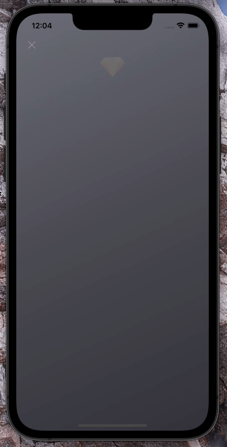

[](https://github.com/WrathChaos/react-native-get-premium-screen)

[](https://www.npmjs.com/package/react-native-get-premium-screen)
[](https://www.npmjs.com/package/react-native-get-premium-screen)

[](https://opensource.org/licenses/MIT)
[](https://github.com/prettier/prettier)

<p align="center">
  
</p>

# Installation

Add the dependency:

```bash
npm i react-native-get-premium-screen
```

## Peer Dependencies

<h5><i>IMPORTANT! You need install them</i></h5>

```js
"react-native-animated-component": ">= 0.2.0",
"react-native-linear-gradient": ">= 2.5.6"
```

# Usage

## Import

```jsx
import PremiumScreen from "react-native-get-premium-screen";
```

## Fundamental Usage

```jsx
<PremiumScreen
  title="Get Premium"
  planListTitle="Choose a plan"
  description="Lorem ipsum dolor sit amet, consectetur adipiscing elit. Aliquam massa mauris, pretium bibendum orci in consectetur vulputate erat."
/>
```

## Example Project 😍

You can checkout the example project 🥰

Simply run

- `npm i`
- `react-native run-ios/android`

should work of the example project.

# Configuration - Props

## Fundamentals

| Property      |  Type  |  Default  | Description                |
| ------------- | :----: | :-------: | -------------------------- |
| title         | string | undefined | change the title           |
| description   | string | undefined | change the descrition      |
| planListTitle | string | undefined | change the plan list title |

## Customization (Optionals)

| Property                      |        Type         |              Default              | Description                                                        |
| ----------------------------- | :-----------------: | :-------------------------------: | ------------------------------------------------------------------ |
| backgroundColors              |      string[]       | ["#6a6b76", "#494951", "#323239"] | change the screen linear gradient colors                           |
| onPress                       |      function       |             undefined             | set your own logic for the button functionality when it is pressed |
| disableCloseButton            |       boolean       |               false               | disable / remove the close button                                  |
| ImageComponent                |      component      |               Image               | set your own component instead of `Image` component                |
| TextComponent                 |      component      |               Text                | set your own component instead of `Text` component                 |
| logoImageSource               | ImageSourcePropType |              default              | change the logo image source                                       |
| checkImageSource              | ImageSourcePropType |              default              | change the check image source                                      |
| closeButtonImageSource        | ImageSourcePropType |              default              | change the close button image source                               |
| logoContainerStyle            |      ViewStyle      |              default              | set/override the logo container style                              |
| logoImageStyle                |     ImageStyle      |              default              | set/override the logo image style                                  |
| closeButtonStyle              |      ViewStyle      |              default              | set/override the close button style                                |
| closeButtonImageStyle         |     ImageStyle      |              default              | set/override the close button image style                          |
| titleContainerStyle           |      ViewStyle      |              default              | set/override the title container style                             |
| titleTextStyle                |      TextStyle      |              default              | set/override the title text style                                  |
| descriptionTextStyle          |      TextStyle      |              default              | set/override the description text style                            |
| premiumFeaturesContainerStyle |      ViewStyle      |              default              | set/override the premium features container style                  |
| premiumFeatureItemTextStyle   |      TextStyle      |              default              | set/override the premium features item text style                  |
| planListContainerStyle        |      ViewStyle      |              default              | set/override the plan list container style                         |
| planListTitleTextStyle        |      TextStyle      |              default              | set/override the plan list title text style                        |

## Future Plans

- [x] ~~LICENSE~~
- [ ] Write an article about the lib on Medium

## Author

FreakyCoder, kurayogun@gmail.com

## License

React Native Get Premium Screen is available under the MIT license. See the LICENSE file for more info.
